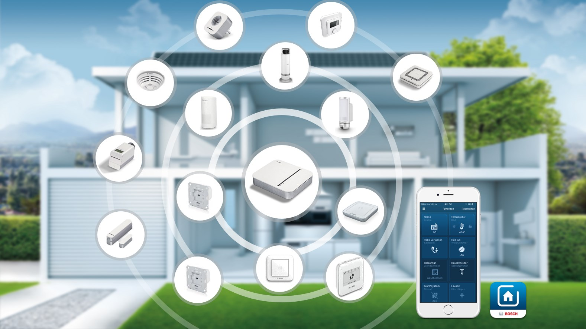

# Bosch Smart Home Files

## Contents

- [Overview](#overview)
- [Firmware OTAU Files](#firmware-otau-files)
- [Watch this repository](#watch-this-repository)
- [Terms and Conditions](#terms-and-conditions)

## Overview

[Bosch Smart Home](https://www.bosch-smarthome.com/) products allow you to automatically and remotely control the processes in your home. Each device has a unique purpose in your Smart Home and provides ease and convenience to your changing daily routines. Whether you want to network your heating system or secure the safety of your home, the Bosch Smart Home System offers you complete and personalised solutions to you and your home's needs. 

## Files
### Firmware OTAU files
In this repository we provide official OTAU (over-the-air-update) files for our [Bosch Smart Home devices](https://www.bosch-smarthome.com/de/de/produkte/geraete/) with ZigBee protocol. These files are only necessary if your devices are not connected with a [Bosch Smart Home Controller](https://www.bosch-smarthome.com/de/de/produkte/geraete/smart-home-controller/).  

## Watch this repository
Watch this repository to get notified when we change or update our Terms and Conditions or when there are changes or updates in the files. In case the Terms and Conditions are changed, the commit message will always contain the keyword `T&C`.

## Terms and Conditions
Robert Bosch Smart Home GmbH, Schockenriedstr. 17, 70565 Stuttgart, Germany ("Bosch Smart Home") provides files to **private, non-profit** Users ("User") which are related to the Bosch Smart Home.

By accepting these Terms and Conditions, through either accessing or using the files, the User agrees to be bound by these Terms and Conditions.

### Definitions
"Files" refers to the files provided by Bosch Smart Home for private, non-profit Users

"Bosch Smart Home Devices" = "devices" 

"Documentation" refers to the provided files description and usage examples.

"Commercial" means intended for or directed towards commercial advantage or monetary compensation. 

Privacy Policy refers to the Privacy Policy found [here](https://www.bosch-smarthome.com/uk/en/privacy-statement).

### Purpose and License
These Terms and Conditions and any and all restrictions and policies implemented by Bosch Smart Home from time to time with respect to the files as set forth in the Documentation govern Users rights to use the files for the purpose of transferring them via ZigBee OTAU to Bosch Smart Home Edge Devices to update the devices firmware.

Subject to these Terms and Conditions, including the restrictions set forth, Bosch Smart Home grants to Users a non-exclusive, non-transferable, non-sublicensable, worldwide, revocable right and license during the Term to privately use the files for firmware updates solely for non-profit usage.

### Restrictions
The licenses of these Terms and Conditions are explicitly conditioned on Users adherence to the following restrictions and compliance with its responsibilities as set forth herein.

The use of the files only applies to private, non-profit individuals. A commercial use in any way, either direct or indirect, is prohibited.

Users will be solely responsible for the technical installation, operation and usage of files.

Users shall, in particular, not bypass any authentication or encryption mechanisms, or misuse files for purposes other than those, which are clearly intended by this Documentation (e.g. updating devices from the Bosch Smart Home System).

Users shall not, under any circumstances, repackage or resell the files.

User is not permitted to use the files in any manner that does or could potentially undermine the security of the Services, Data or any other information stored or transmitted using the files.

In addition, User shall not, and shall not attempt to: interfere with, modify or disable any features, functionality or security controls of the files, defeat, avoid, bypass, remove, deactivate or otherwise circumvent any protection mechanisms for the files, or reverse engineer, decompile, disassemble or derive source code, underlying ideas, algorithms, structure or organizational form from the files.

Users shall fully comply with all applicable governmental, legal, regulatory and professional requirements when using the files, including but not limited to, copyright, trademark rights and data protection. The use of claims (e.g. "works with Bosch") or trademarks (e.g. Bosch logos of any kind) that indicates a direct or indirect involvement with Bosch is prohibited. 

Bosch Smart Home may at its sole and exclusive discretion, change, alter, modify, add and remove features, content and other materials of the Documentation and/or files at any time. Bosch Smart Home may suspend or discontinue any feature, functionality or file provided at any time without any prior notice, obligation or liability.

Users shall not use the files for any action that can cause damages due to the interaction of the files with the home appliances (e.g. by bypassing security prompts on the home appliances, or by executing commands that can cause harm to life or limb, or to the home appliances, or to any other goods).

Users may produce and reproduce this Documentation for their own use, but may not share a modified or derived version of this Documentation.

Users shall not use the files for publication of explicit content or offensive communication.

The Documentation is subject to the [Creative Commons Attribution-NonCommercial-NoDerivatives 4.0 International Public License](https://creativecommons.org/licenses/by-nc-nd/4.0/legalcode).

User must comply with all restrictions and guidelines set forth in this Agreement in all uses of the files. If Bosch Smart Home believes, in its sole discretion, that User has violated or attempted to violate any term, condition or the spirit of this Agreement, the license afforded User pursuant to this Agreement may be temporarily or permanently revoked, with or without notice to User.

### Modifications
User acknowledges and agrees that Bosch Smart Home may modify this Agreement, the files, the General files Policies, and the Privacy Policy, from time to time (a "Modification"). User further acknowledges and agrees that such Modifications may be implemented at any time and without any notice. 

Bosch Smart Home shall have no liability of any kind to User with respect to such Modifications or any adverse effects resulting from such Modifications. 

### Warranty
Bosch Smart Home asks all Users working with their Documentation to inform Bosch Smart Home about any defects found in the files as soon as possible to give Bosch Smart Home a chance to remedy it.

All aspects of the files, including all components, are provided on an "as is" and "as available" basis. 

User acknowledges that Bosch Smart Home does not warrant that the files will be uninterrupted, timely, secure, or error-free and no information or advice obtained by User from Bosch Smart Home or through the Service shall create any warranty not expressly stated in this agreement. Besides that, the statutory warranty shall apply.

### Liability
In accordance with the provisions of law, Bosch Smart Home shall be liable for damages in the following cases: damage to persons; damage governed by the German Product Liability Act (Produkthaftungsgesetz); damage caused by fraudulent behavior or with intent on the part of Bosch Smart Home; and damage caused by gross negligence on the part of their legal representatives or executive staff.

Without prejudice to the liability defined in the section above, the Bosch Smart Homes liability for damages shall be limited to the level of damage foreseeable in contracts of this kind in the case of damage resulting from an ordinarily negligent breach of fundamental contractual obligations as well as in the case of damage caused due to gross negligence by the ordinary vicarious agents. 

Except where there are explicit provisions to the contrary in these Terms and Conditions, Bosch Smart Home shall bear no liability beyond that defined above.

Contributory negligence on the part of the User must be taken into account.

### Indemnity
User will indemnify and hold Bosch Smart Home harmless against any claim brought by a third party against Bosch Smart Home arising from or related to any breach of an obligation, representation, warranty, covenant or other provision of these Terms and Conditions by User or any matter which. User has expressly agreed to be responsible pursuant to these Terms and Conditions.

### Support
This Agreement does not entitle User to any support or technical assistance for the files, unless User makes separate arrangements with Bosch Smart Home for such support.

However, Bosch Smart Home will try their best to respond to issues raised in the [GitHub tracker](https://github.com/BoschSmartHome/bosch-smarthome-files/issues). User should report any trouble he might have with the Documentation exclusively there.

### Confidentiality
User may from time to time, gain access to Confidential Information. User may use Confidential Information only to the extent necessary to exercise its rights under this Terms and Conditions. Subject to the express permissions set forth herein, User may not disclose Confidential Information to a third party without the prior express consent of Bosch Smart Home, provided in writing or by email. Without limiting any other obligation of User under this Terms and Conditions, User agrees that he will protect Confidential Information from unauthorized use, access, or disclosure in the same manner that User would use to protect its own confidential and proprietary information of a similar nature and in any event with no less than a reasonable degree of care.

### General provisions
To the extent permitted by law, the exclusive place of jurisdiction for any legal disputes shall be Stuttgart, Germany.

These Terms and Conditions as well as all agreements between Bosch Smart Home and the User in this regard shall be subject to German law. It is hereby explicitly stipulated that the United Nations Convention on Contracts for the International Sale of Goods shall not be applicable.

Should a provision be or become invalid, this shall not affect the validity or effectiveness of the other provisions. In such a case, the invalid provision should be replaced by a valid agreement that is as similar as possible to the commercial intention of the original, invalid provision.

*January 26th, 2025*
